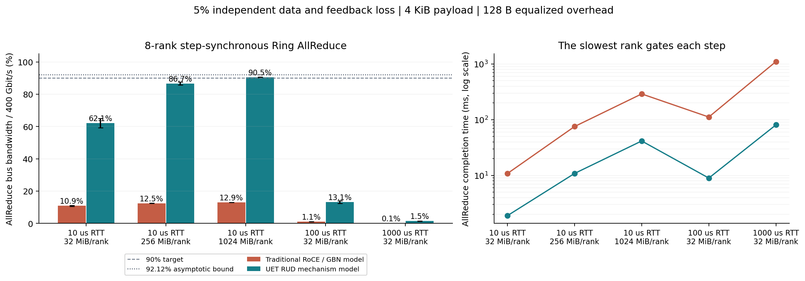
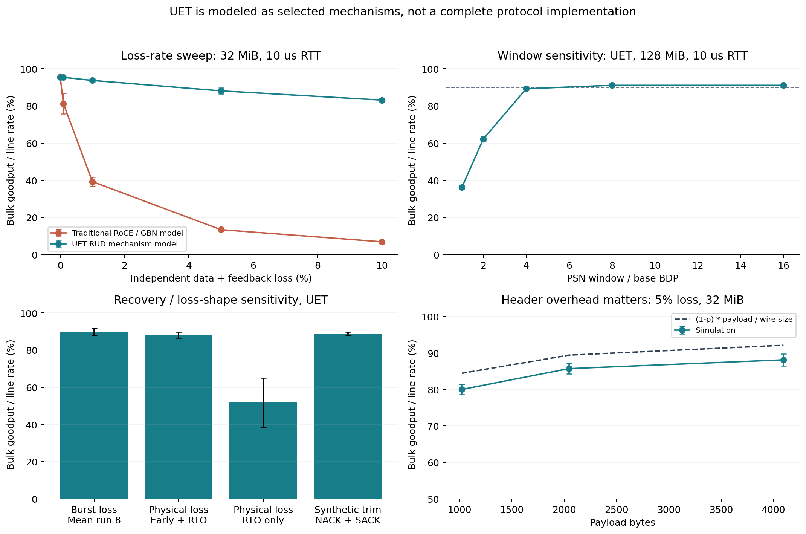

# 实验 001：5% 故障丢包下，RDMA 能否达到 90% Goodput？

**在本次机制级模型中可以，但有明显的消息大小、RTT 和窗口条件，不能把它当作 UET 或 CIPU 的普遍性能保证。**

8 rank、每 rank 1 GiB、400 Gbit/s、10 us RTT 时，UET RUD 风格模型得到
**90.545% ± 0.251 个百分点**，
传统按序接收 + Go-Back-N 模型为 **12.949% ± 0.040 个百分点**。
对应 bus bandwidth 分别为 362.18 和 51.79 Gbit/s，
完成时间为 41.505 和 290.232 ms，Goodput 均值比约 6.99 倍。

这里的“UEC”具体指**参考 UET RUD 的若干机制**：逐包喷洒、保留乱序包、
累积 ACK + ACK PSN + 64 位 SACK、受保护的早期重传及 RTO。没有完整实现 UET 协议栈。
传统基线也不代表所有厂商当前的 RoCEv2 实现。详细假设见 [METHOD.md](METHOD.md)。

## 与 CIPU 2.0 原文的关系

找到了 [Zartbot 的 CIPU 文章，第 2.4 节](https://zartbot.github.io/blog/arch/cipu/index.html)，
确实给出 CIPU 2.0 在 5% 丢包下达到 90% Goodput 的陈述，并讨论 SACK 与多路径。
公开文字未给出复现实验必需的消息大小、RTT、包长、连接数、反馈丢失条件或指标分母，
也没有证明它就是 UET 标准实现。本实验支持这种量级的结果在一定条件下具有可行性，
**不能据此验证该产品数字，更不能推断其未公开算法**。

## 8 rank Ring AllReduce 的结果

主实验两端每次发送均独立丢包：数据及其重传包 5%，ACK/NACK 5%。
链路本身不因拥塞而丢包，主实验 **Trim = 0**。每个有损条件运行 5 个种子。
表中的 ± 是均值的 95% Student-t 区间半宽，仅包括随机抽样变化。

固定参数：4096 B 有效载荷、统一 128 B 数据开销、96 B 反馈包、每 4 包反馈、
8 BDP 的 PSN 窗口且上限 32640 包；RTT 不含序列化时间。
每个场景中所有 Ring 边使用同一 RTT，因此 100/1000 us 行是受控的长 RTT 场景，
不对应一个已经校准的多站点部署。

| RTT (us) | 每 rank 张量 (MiB) | GBN Goodput (%) | UET 模型 Goodput (%) | 均值之比 |
|---:|---:|---:|---:|---:|
| 10 | 32 | 10.871 ± 0.359 | 62.085 ± 2.901 | 5.71x |
| 10 | 256 | 12.459 ± 0.125 | 86.661 ± 0.883 | 6.96x |
| 10 | 1024 | 12.949 ± 0.040 | 90.545 ± 0.251 | 6.99x |
| 100 | 32 | 1.052 ± 0.028 | 13.138 ± 0.812 | 12.49x |
| 1000 | 32 | 0.106 ± 0.003 | 1.459 ± 0.099 | 13.72x |



**相同的 5% 丢包率并不能唯一确定 Goodput。**
每 rank 32 MiB 会被拆成每步 4 MiB，一共 14 步；较短的传输更容易被启动、
尾包恢复和最慢 rank 拖住。增大消息能摊薄这些开销。
长 RTT 下，无损基线本来就很低，应同时看下表，不能把所有下降都归因于丢包。

| RTT (us) | 每 rank 张量 (MiB) | UET 无损 Goodput (%) | 有损/无损 (%) | GBN 时间 (ms) | UET 时间 (ms) |
|---:|---:|---:|---:|---:|---:|
| 10 | 32 | 86.029 | 72.168 | 10.810 | 1.894 |
| 10 | 256 | 95.452 | 90.790 | 75.411 | 10.842 |
| 10 | 1024 | 96.586 | 93.746 | 290.232 | 41.505 |
| 100 | 32 | 44.737 | 29.368 | 111.672 | 8.956 |
| 1000 | 32 | 7.714 | 18.916 | 1104.552 | 80.681 |

本实验采用分步屏障 Ring，不包含 NCCL 的子块流水化、多 channel、GPU 计算重叠、
真实 NIC 资源或实际跨站点拓扑。上述跨站点数字是此模型的结果，不是对生产系统的预测。

## Goodput 的分母与可达到的上界

单大流使用有效字节 / 完成时间 / 端口速率；AllReduce 使用
`[S/T * 2(N-1)/N] / C`。后一换算来自
[NVIDIA nccl-tests 的 bus bandwidth 定义](https://github.com/NVIDIA/nccl-tests/blob/master/doc/PERFORMANCE.md)。
8 rank 的系数是 1.75，`S/T` 自身并不是相同口径的 Goodput。

独立数据包丢失概率为 p 时，理想长流选择性重传的发送次数约为 `1/(1-p)`。
本次大消息 UET 模型的实测发送放大倍数为 1.0535，
接近理论的 1.0526；GBN 为 7.2639，大量带宽花在已经失序的后续包上。

在不计启动、反馈争用与空闲的理想情况下：

```text
G / C <= (1-p) * payload / (payload + overhead)
       = 0.95 * 4096 / (4096 + 128)
       = 92.12%
```

因此 90% 接近这个设定的上界；它不是“丢 5% 就必然还能跑 95%”。
如果将有效载荷改为 1 KiB，同样开销下上界只有 84.44%。
相对无损保留 90% 性能与达到线速的 90% 也不是同一个命题。

## 什么因素决定能否接近 90%

128 MiB 大流、10 us RTT、5% 数据和反馈丢包的窗口扫描如下。
窗口限制的是 PSN 范围，不能只计算尚未 SACK 的包数来绕开重排资源约束。

| PSN 窗口 / BDP | 包数 | UET Bulk Goodput (%) |
|---:|---:|---:|
| 1 | 119 | 36.147 ± 0.802 |
| 2 | 237 | 62.193 ± 1.451 |
| 4 | 474 | 89.267 ± 0.545 |
| 8 | 947 | 91.106 ± 0.591 |
| 16 | 1894 | 91.106 ± 0.591 |

在这个模型和负载下，8 BDP 已接近平台区；16 BDP 没有继续提升。
这个数字是所选恢复时延与负载下的结果，不是对所有网卡的窗口配置建议。

| 32 MiB 大流，10 us RTT | Goodput (%) | 实测数据故障丢包 (%) |
|---|---:|---:|
| 突发丢包，坏状态平均 8 包 | 89.873 ± 1.850 | 4.658 |
| 独立故障丢包，早期检测 + RTO | 88.112 ± 1.693 | 5.139 |
| 独立故障丢包，只有 RTO | 51.754 ± 13.349 | 5.153 |
| 合成 Trim，NACK + SACK | 88.760 ± 0.895 | 0.000 |

只有 SACK、但仍主要等待 RTO，会留下明显的空闲与长尾。Trim 的通知可以更早，
但它只适用于合成的交换机准入丢失对照；故障使完整包消失后不可能保留可用包头。
这一点依据 [UE Specification 1.0.3 §3.5.15、§4.1](https://ultraethernet.org/wp-content/uploads/sites/20/2026/08/UE-Specification-1.0.3.pdf)。
突发丢包对照的有限样本实测比例也列在表中；不能仅根据这五次试验说突发丢包更容易处理。



在 1 ms RTT 下，固定小窗口尤其不合适，且扩大窗口并非唯一需要解决的问题：

| 大流大小 (MiB) | PSN 窗口 (包) | Goodput (%) | 数据发送放大倍数 |
|---:|---:|---:|---:|
| 128 | 512 | 1.327 ± 0.040 | 1.055 |
| 128 | 8192 | 13.913 ± 1.037 | 1.055 |
| 128 | 32640 | 33.446 ± 4.550 | 1.391 |
| 1024 | 32640 | 47.063 ± 1.497 | 1.398 |

本模型在大 BDP 下还受到有限 SACK 反馈、累计确认进度和简单早期检测策略的制约；
较大的发送放大倍数表明重复重传也增加了。多 PDC 聚合、ACK 策略、尾包探测、
窗口资源和更好的 collective 流水化需要进一步研究，不能把局域网中的 90% 直接外推。

## 实现边界与验证

- 本实验使用 Python 3.10.19，自建分组离散事件内核，无 C++ 或 ns-3 运行依赖。
- 参考 [IRN](https://cs.nyu.edu/~apanda/assets/papers/sigcomm18-irn.pdf)、
  [HPCC 的 ns-3 实现](https://github.com/alibaba-edu/High-Precision-Congestion-Control)
  与 UET 正式规范的机制；没有通过与 ns-3 或硬件对齐来校准绝对性能。
- 独立数据及反馈链路已经计入各自序列化时间，但没有实现真实 Ring NIC 上两者的端口竞争。
  1 GiB UET 场景的反馈/正向线速字节比约为 0.583%，
  在 90% 这一临界数字附近，这种简化仍值得后续验证。
- 没有模拟 PFC/ECN、拥塞控制、共享队列、链路层重试、FEC、故障路由收敛或 GPU/PCIe 限制。
- 已通过 30 项验证；包括 GBN 加速版本与显式逐包事件的等价性、丢包恢复、去重、SACK 单调性、
  小窗口以及 AllReduce 的字节数和依赖约束。
- 共 192 个任务，4 个进程；本轮命令墙钟时间约 218.9 秒。
  若使用了 `--resume`，该时间不包含之前已完成检查点的计算时间。
  所有有损条件保留原始种子，均未将丢失包从重传损失概率中排除。

## 文件与复现

- [配置](../../configs/001_loss_recovery.yaml)：全部 192 个任务的参数来源。
- [协议模型](../../src/ai_infra_simulator/transport.py) / [AllReduce 模型](../../src/ai_infra_simulator/collectives.py)。
- [试验明细 CSV](trials.csv) / [汇总与置信区间 CSV](summary.csv) / [运行元数据](run_metadata.json)。
- 本地 `results/001_loss_recovery/jobs/` 还保存每个任务、每一步、每个 rank 的计数器及时间。
- [详细模型说明](METHOD.md) 列出源文献和全部假设。

```bash
cd /Volumes/P4P/Projects/AI-Infra-Sim/code
source .venv/bin/activate
python -m pytest -q
OPENBLAS_NUM_THREADS=1 python run_experiment.py --workers 4
python scripts/build_loss_report.py
```

本次模拟源码 SHA-256：`96d31294aa0c1d49da344f9687952f0d030a95f8f32e6cf6f3c14ff58f126b70`。
恢复已完成的同版本任务可增加 `--resume`；修改实现后请使用新的结果目录。
