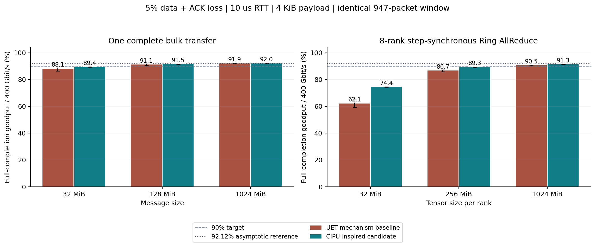

# 实验 002：CIPU 2.0 启发的恢复策略

在 Python 3.10.19 中，候选方案在 **5% 数据及反馈独立丢失**时，
128 MiB Bulk 的完整完成 Goodput 为 **91.50 ± 0.22%**（95% CI），
即 **366.01 Gbit/s**；8 rank、每 rank 1 GiB 的 Ring 结果为 **91.31 ± 0.03%**。
这证明在下述模型条件下可以超过 90%，不构成 CIPU 芯片性能复现。

## 公开资料与设计

[原文 §2.4](https://zartbot.github.io/blog/arch/cipu/index.html) 提到 CIPU 2.0 的 5%/90% 结果，
但本次可读取的正文没有完整的测试参数。公开方向包括有损、多路径、SACK 和 RC 接口兼容；
本次设计的重叠反馈、区间反馈补充、短计时器和尾部副本不能归为厂商已公开算法。
详见 [搜索分析与候选说明](RESEARCH.md)。

候选与 UET 机制基线均为 400 Gbit/s、10 us RTT、4 KiB 有效载荷、128 B 统一开销、
四路径、单逻辑连接、947 包窗口（约 8 BDP）。区别仅在反馈与恢复策略。
候选尾部重传总副本数为 3；所有副本、控制包都序列化并可能丢失。物理故障不产生 Trim。

## 完整结果

表中 `±` 为 95% CI 半宽，5 个独立种子；Goodput 以端口线速为分母。
最后一列另外报告相对无损性能，避免把两种“90%”混为一谈。

| 场景 | 大小 MiB（Ring 为每 rank） | UET 基线 % | 候选 % | 候选完成 ms | 候选相对无损保留率 |
|---|---|---|---|---|---|
| Bulk | 32 | 88.11 ± 1.69 | 89.41 ± 0.14 | 0.751 | 93.67% |
| Bulk | 128 | 91.11 ± 0.59 | 91.50 ± 0.22 | 2.934 | 94.74% |
| Bulk | 1024 | 91.94 ± 0.05 | 92.00 ± 0.06 | 23.342 | 94.92% |
| Ring AllReduce | 32 | 62.09 ± 2.90 | 74.45 ± 0.19 | 1.577 | 86.54% |
| Ring AllReduce | 256 | 86.66 ± 0.88 | 89.26 ± 0.08 | 10.526 | 93.51% |
| Ring AllReduce | 1024 | 90.55 ± 0.25 | 91.31 ± 0.03 | 41.159 | 94.54% |



128 MiB 候选发送尝试/有效包为 **1.05333**，
理想纯选择重传为 1/0.95 = 1.05263；实际数据丢失比例为 **4.987%**。
反向反馈字节/正向数据字节为 **0.628%**，
观察到的乱序有效载荷峰值均值为 **1.768 MiB**。

90% 不是所有消息都能达到。短消息、每步等待最慢 rank、尾部连续丢失都会放大额外 RTT。
4 KiB+128 B 和 5% 丢失给出的渐近参考只有 92.12%；高 Goodput 要求恢复接近最少必要重传。
此场景中已有 UET 风格基线也能超过 90%，因此 90% 本身不足以证明某种专有实现或标准身份。

## 突发损失对照

下表为平均坏状态持续 8 个发送尝试的两态模型，仍标定长期损失率 5%；128 MiB、10 us。
各次有限样本实际丢包率并不完全一致，不能仅据均值推断突发损失更容易处理。

| 策略 | Goodput % | 实际丢包 % | 发送尝试/有效包 |
|---|---|---|---|
| CIPU 启发候选 | 89.96 ± 0.78 | 4.641 | 1.0734 |
| UET 机制基线 | 91.83 ± 0.68 | 4.673 | 1.0499 |

在这个突发模型中，候选反而慢于基线，说明短计时器和相邻的冗余重传并非对所有故障分布都有利。
因此本实验的超过 90% 结论限定在所报告的独立丢包条件，不能推及连续闪断或黑洞。

## 复现与边界

```bash
source .venv/bin/activate
OPENBLAS_NUM_THREADS=1 python run_recovery_study.py --config configs/002_cipu_inspired.yaml --output ../results/002_cipu_inspired --workers 4
python scripts/build_recovery_reports.py --study 002
```

82 个任务，Python 3.10.19。参数和所有样本见
[配置](../../configs/002_cipu_inspired.yaml)、[summary.csv](summary.csv)、[trials.csv](trials.csv)、[manifest.json](manifest.json)。
完整任务集、来源和守恒核验见 [verification.json](verification.json)。
源码 SHA-256：`d81ff60116339582320397c419d1e14ced2e0ff4c8d0e476f481395b099133af`。

AllReduce 是通信专用的分步 Ring，不含计算和 NCCL 流水，也未模拟邻居数据与反向 ACK 的物理 NIC 争用。
无交换机拥塞、在线 RTT 估计、持续链路中断或生产硬件校准。
完整假设、控制包成本、资源定义和协议依据见 [公共方法](../003_scale_across/METHOD.md)。
