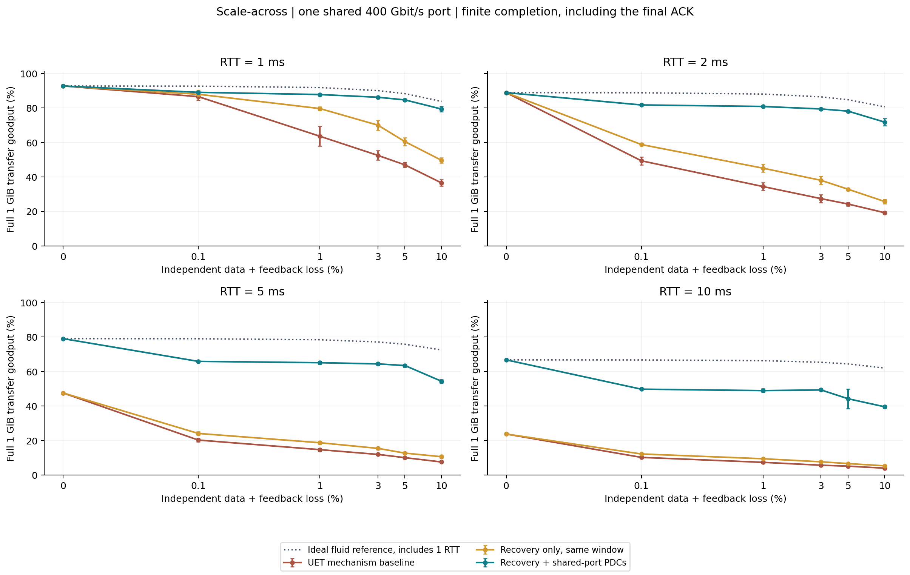
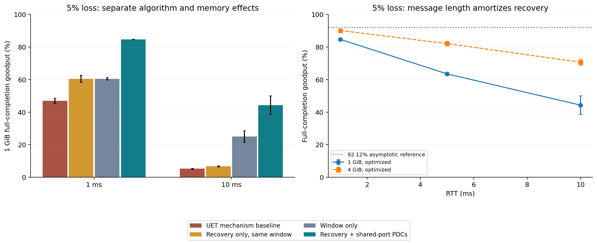

# 实验 003：长 RTT、不同丢包率与受资源约束的恢复优化

在 400 Gbit/s、1 GiB 完整消息、数据和反馈均独立丢失 5% 的条件下，
RTT 1 ms 的 UET 机制基线为 **47.06 ± 1.50%**，联合优化为 **84.72 ± 0.04%**；
RTT 10 ms 时分别为 **5.21 ± 0.28%** 和 **44.29 ± 5.68%**。
这些是包含启动、等待及最终确认的完成 Goodput，不是无限长流的吞吐率。

## 策略与选参

使用重叠 SACK、区间收尾反馈、更短恢复计时器和尾部选择性冗余，
再把消息条带化到多个有界 PDC；所有 PDC 共享同一 400 Gbit/s 端口。
用独立训练种子搜索 9 组参数，选择 **8 BDP 目标窗口、尾部总副本 3**，
聚合窗口有效载荷预算不超过 **2 GiB**，最多 **64 PDC**。
结果中的“最优”仅指此候选集合及训练目标，不是所有协议、拓扑和负载的全局最优。
实现、依据、资源定义和未模拟因素详见 [METHOD.md](METHOD.md)。

## 完整 RTT × 丢包率矩阵

每点 1 GiB；每包 4096 B 有效载荷 + 128 B 统一开销；四路径单程跨度 2 us。
`±` 为 95% CI 半宽，主矩阵有损点 n=5；无损点确定性 n=1。
“仅优化恢复”维持基线的单 PDC 与相同窗口，便于识别算法本身的收益。

| RTT ms | 丢包 % | UET 基线 % | 仅优化恢复 % | 联合优化 % |
|---|---|---|---|---|
| 1 | 0 | 92.78 ± 0.00 | 92.78 ± 0.00 | 92.78 ± 0.00 |
| 1 | 0.1 | 86.63 ± 2.16 | 88.00 ± 2.38 | 89.12 ± 0.56 |
| 1 | 1 | 63.66 ± 5.67 | 79.71 ± 1.08 | 87.83 ± 0.05 |
| 1 | 3 | 52.56 ± 2.74 | 70.08 ± 2.80 | 86.26 ± 0.04 |
| 1 | 5 | 47.06 ± 1.50 | 60.53 ± 2.22 | 84.72 ± 0.04 |
| 1 | 10 | 36.60 ± 1.87 | 49.71 ± 1.53 | 79.41 ± 1.51 |
| 2 | 0 | 88.93 ± 0.00 | 88.93 ± 0.00 | 88.94 ± 0.00 |
| 2 | 0.1 | 49.44 ± 2.31 | 58.86 ± 0.62 | 81.80 ± 0.34 |
| 2 | 1 | 34.52 ± 2.21 | 45.16 ± 2.29 | 80.92 ± 0.03 |
| 2 | 3 | 27.50 ± 2.31 | 38.13 ± 2.41 | 79.48 ± 0.47 |
| 2 | 5 | 24.38 ± 1.11 | 32.96 ± 0.73 | 78.23 ± 0.46 |
| 2 | 10 | 19.36 ± 0.65 | 25.85 ± 1.29 | 71.86 ± 2.08 |
| 5 | 0 | 47.62 ± 0.00 | 47.62 ± 0.00 | 79.11 ± 0.00 |
| 5 | 0.1 | 20.34 ± 0.97 | 24.17 ± 1.01 | 65.93 ± 0.24 |
| 5 | 1 | 14.78 ± 0.87 | 18.80 ± 0.79 | 65.16 ± 0.82 |
| 5 | 3 | 12.01 ± 0.56 | 15.51 ± 0.85 | 64.47 ± 0.80 |
| 5 | 5 | 10.13 ± 0.40 | 12.76 ± 0.69 | 63.51 ± 0.94 |
| 5 | 10 | 7.63 ± 0.37 | 10.68 ± 0.66 | 54.39 ± 0.92 |
| 10 | 0 | 23.84 ± 0.00 | 23.83 ± 0.00 | 66.80 ± 0.00 |
| 10 | 0.1 | 10.30 ± 0.50 | 12.27 ± 0.52 | 49.82 ± 0.06 |
| 10 | 1 | 7.43 ± 0.39 | 9.52 ± 0.41 | 48.99 ± 1.14 |
| 10 | 3 | 5.75 ± 0.32 | 7.73 ± 0.43 | 49.38 ± 0.01 |
| 10 | 5 | 5.21 ± 0.28 | 6.71 ± 0.36 | 44.29 ± 5.68 |
| 10 | 10 | 4.05 ± 0.21 | 5.41 ± 0.33 | 39.62 ± 0.93 |



单 PDC 常规 32640 包窗口只有 127.5 MiB 有效载荷；400 Gbit/s、10 ms 的线速 BDP 已达 500 MB。
窗口耗尽、累计确认缺口以及有限 SACK 的覆盖延迟会造成停顿或误重传。
扩大窗口和改善反馈解决的是不同问题，且尾部仍可能需要多个 RTT。
UET 标准允许不同实现，这个基线的数字不能代表所有 UET 产品。

## 5% 丢包：资源与消融

下表给出联合优化所用的实际 PDC 数和配置窗口；乱序峰值是逐次运行峰值的均值。
窗口有效载荷预算不是 NIC SRAM 需求，重放描述符、bitmap、宿主/GPU 存储需另行设计。

| RTT ms | PDC 数 | 配置窗口 MiB | 实测乱序峰值均值 MiB | 完成 ms | 提速比 |
|---|---|---|---|---|---|
| 1 | 3 | 369.91 | 140.35 | 25.35 | 1.80× |
| 2 | 6 | 739.82 | 237.19 | 27.45 | 3.21× |
| 5 | 15 | 1849.55 | 551.11 | 33.82 | 6.27× |
| 10 | 17 | 2048.00 | 951.62 | 48.90 | 8.49× |

| RTT ms | 策略 | Goodput % | 发送尝试/有效包 | 反馈/数据字节 % |
|---|---|---|---|---|
| 1 | 仅优化恢复 | 60.53 ± 2.22 | 1.0565 | 0.648 |
| 1 | 联合优化 | 84.72 ± 0.04 | 1.0571 | 0.718 |
| 1 | UET 机制基线 | 47.06 ± 1.50 | 1.3981 | 0.977 |
| 1 | 仅扩展窗口 | 60.51 ± 0.74 | 1.3844 | 0.980 |
| 10 | 仅优化恢复 | 6.71 ± 0.36 | 1.0576 | 0.673 |
| 10 | 联合优化 | 44.29 ± 5.68 | 1.1013 | 2.194 |
| 10 | UET 机制基线 | 5.21 ± 0.28 | 1.0665 | 0.640 |
| 10 | 仅扩展窗口 | 24.97 ± 3.51 | 1.0681 | 2.159 |



反向反馈独立付出序列化及丢失代价。尾部副本也占用数据端口，
因此优化可能用更高的发送放大换取更短收尾，不能称作免费纠错。
5% 丢失下的渐近参考为 92.12%；10% 丢失下只有 87.27%，后者无法靠纯重传达到 90% 线速 Goodput。

## 长流、AllReduce 和鲁棒性

`wan_long_flow` 为 4 GiB 完整消息（不是截取稳态区间）；`wan_allreduce` 为 8 rank、每 rank 1 GiB，
所有逻辑邻居都使用表内长 RTT；`wan_path_skew` 为 100 us 路径时延跨度；
`wan_burst` 为平均连续丢 8 个发送尝试的两态模型。四组均为 5% 标定丢包率。
WAN 的两态过程按 PDC 独立生成，改变条带数也会改变端口聚合损失相关性；
这组不能用来推断面对同一物理链路突发轨迹的公平性能优势。002 的突发对照双方均为单 PDC。

| 实验组 | RTT ms | 大小 MiB | 策略 | Goodput % | 完成 ms | 重复数 |
|---|---|---|---|---|---|---|
| wan_allreduce | 1 | 1024 | 联合优化 | 51.17 ± 1.43 | 73.44 | 3 |
| wan_allreduce | 10 | 1024 | 联合优化 | 8.44 ± 0.16 | 445.35 | 3 |
| wan_allreduce | 1 | 1024 | UET 机制基线 | 28.64 ± 0.96 | 131.21 | 3 |
| wan_allreduce | 10 | 1024 | UET 机制基线 | 3.12 ± 0.74 | 1213.02 | 3 |
| wan_burst | 1 | 1024 | 联合优化 | 80.60 ± 3.47 | 26.67 | 5 |
| wan_burst | 1 | 1024 | UET 机制基线 | 53.00 ± 3.21 | 40.60 | 5 |
| wan_long_flow | 1 | 4096 | 联合优化 | 90.15 ± 0.06 | 95.28 | 3 |
| wan_long_flow | 5 | 4096 | 联合优化 | 82.12 ± 1.36 | 104.61 | 3 |
| wan_long_flow | 10 | 4096 | 联合优化 | 70.66 ± 1.93 | 121.58 | 3 |
| wan_path_skew | 1 | 1024 | 联合优化 | 84.49 ± 0.26 | 25.42 | 5 |
| wan_path_skew | 1 | 1024 | UET 机制基线 | 46.85 ± 1.22 | 45.85 | 5 |

Ring 每一步等待最慢 rank，共 14 步，长 RTT 的收尾代价被重复放大。
更长消息能摊薄固定开销，但无法消除它。真实跨机房训练还应研究机房内归约、机房间交换、
跨阶段流水和更好的站点拓扑；这些不在本次模拟范围内，未将预期收益写成已实现性能。

## 全部搜索结果与独立验证

训练场景：1 GiB、RTT 1/10 ms、5% 丢包，种子 3/7；9 组参数共 36 次。
目标为完整完成 Goodput 的几何平均；距最好 1% 内优先节省窗口，再减少副本。
随后才用种子 11/29/47/71/101 做主评估（长流和 Ring 使用前三个）。

| 目标 BDP 倍数 | 尾部总副本 | 训练几何平均 Goodput % | 训练平均窗口 MiB |
|---|---|---|---|
| 8 | 3 | 63.962 | 1208.96 |
| 4 | 3 | 60.468 | 1017.25 |
| 8 | 2 | 57.378 | 1208.96 |
| 4 | 2 | 55.919 | 1017.25 |
| 8 | 1 | 49.741 | 1208.96 |
| 4 | 1 | 46.777 | 1017.25 |
| 2 | 3 | 37.994 | 508.63 |
| 2 | 2 | 36.295 | 508.63 |
| 2 | 1 | 32.898 | 508.63 |

保留 [selection.json](selection.json)、[tuning_summary.csv](tuning_summary.csv)、
[tuning_trials.csv](tuning_trials.csv)、[summary.csv](summary.csv)、[trials.csv](trials.csv)
与 [manifest.json](manifest.json)。没有根据评估结果重新选择或隐去较差点。
完整任务集、来源和守恒核验见 [verification.json](verification.json)。

## 复现

```bash
source .venv/bin/activate
OPENBLAS_NUM_THREADS=1 python run_recovery_study.py --config configs/003_scale_across.yaml --output ../results/003_scale_across --phase tune --workers 4
OPENBLAS_NUM_THREADS=1 python run_recovery_study.py --config configs/003_scale_across.yaml --output ../results/003_scale_across --phase eval --workers 4
python scripts/build_recovery_reports.py --study 003
```

本次 363 个评估任务，另有 36 个训练任务；Python 3.10.19。
源码 SHA-256：`d81ff60116339582320397c419d1e14ced2e0ff4c8d0e476f481395b099133af`。相同源码和配置可用 `--resume`；不匹配会拒绝复用。

模型不含交换机排队/拥塞控制、GPU 计算、在线 RTT 估计或链路黑洞。
AllReduce 延续独立逻辑链路近似，未模拟邻居数据与反向 ACK 在同一物理 NIC 上的争用。
因此这些结果可比较恢复机制及资源瓶颈，不能作为商用硬件或真实多机房 NCCL 性能保证。
