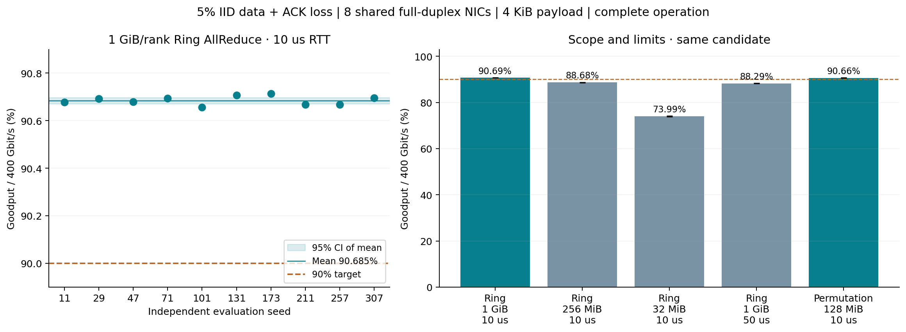
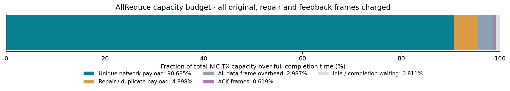

# 实验 004：5% 丢包下超过 90% Goodput

**验收结果：PASS。** 在 8 rank、每 rank 1 GiB、400 Gbit/s、10 us 名义 RTT 的 Ring AllReduce 通信仿真中，
数据及 ACK 均有 5% 独立丢失时，完整操作 Goodput 为 **90.685% ± 0.013 个百分点**（均值的 95% CI）。
10 个独立正式种子全部超过 90%，最小值 **90.656%**，置信区间下界 **90.672%**。

这对应每 rank **362.74 Gbit/s** 的有效网络带宽和 **41.441 ms** 的平均完成时间。
所有数据、ACK、重传、冗余副本均计入物理端口预算，并计入起步和最终确认时间。
独立的 128 MiB/rank permutation 对照达到 **90.664% ± 0.133**，该指标不含 AllReduce 换算因子。

本实验在 Python **3.10.19** 中真实执行；结果来自分组事件仿真，不是解析公式生成的样本。
它验证了一个合理数据中心场景中的可达性；并非 CIPU 实测、完整 UET 实现或跨场景最优性证明。

## 场景和策略

| 项目 | 设定 |
|---|---|
| 网络 | 8 个端点，各一个全双工 400 Gbit/s NIC，非阻塞内部 fabric |
| 业务 | 每 rank 1 GiB 张量；Ring 14 阶段，每阶段每 rank 128 MiB |
| 时延 | 10 us 传播/固定处理 RTT，另加收发序列化与队列；四路径总偏差 2 us |
| 数据/反馈 | payload 4096 B + 总开销 128 B；ACK 96 B；数据与 ACK 共享本端 TX 和目的端 RX |
| 故障 | 每次数据发送、每个 ACK 均独立以 5% 概率丢失；重传和副本无豁免；Trim=0 |
| 恢复 | 乱序接收、重叠 SACK、区间反馈补充、短 RTT 恢复定时器、尾部重传总副本数 3 |
| 资源 | 每连接窗口 947 包，约 3.699 MiB payload span；每目的端口 RX 队列上限 256 KiB |
| 原则 | 参数在正式运行前固定；试跑 seed 3 与正式种子分开 |

400 GbE 和 4 KiB 包长的公开依据、协议步骤及完整简化条件见 [方法与依据](METHOD.md)。
核心原因是选择性恢复把平均发送放大控制在 **1.05401 倍**，接近理想的 1/0.95=1.05263；
较大窗口和大块通信使平均 NIC TX 利用率达到 **99.189%**。
反馈占数据字节的 **0.6284%**；这些反馈使用同一物理 NIC 的发送带宽。

## 结果与边界

| 场景 | 种子数 | Goodput %（均值 ± 95% CI 半宽） | 最低 % | 完成时间 ms |
|---|---|---|---|---|
| 候选：1 GiB/rank AllReduce，10 us | 10 | 90.685 ± 0.013 | 90.656 | 41.441 |
| 机制基线：1 GiB/rank AllReduce，10 us | 5 | 90.113 ± 0.121 | 90.001 | 41.704 |
| 候选：256 MiB/rank AllReduce，10 us | 5 | 88.676 ± 0.054 | 88.625 | 10.595 |
| 候选：32 MiB/rank AllReduce，10 us | 5 | 73.987 ± 0.183 | 73.783 | 1.587 |
| 候选：1 GiB/rank AllReduce，50 us | 5 | 88.289 ± 0.060 | 88.224 | 42.566 |
| 候选：128 MiB/rank permutation，10 us | 5 | 90.664 ± 0.133 | 90.500 | 2.961 |
| 候选：1 GiB/rank AllReduce，无损参考 | 1 | 96.007（确定性） | 96.007 | 39.144 |

除无损参考行外，表中数据和 ACK 丢失概率均为 5%。CI 是跨种子的双侧 Student-t 区间；无损参考不估计随机区间。
机制基线使用相同网络、包长和 8 BDP 窗口，保留滚动 SACK、较长定时器，禁用候选的覆盖反馈与尾部副本。
基线在这个大块、短 RTT 场景也达到约 90.11%；候选平均增加 **0.572 个百分点**。
因此，达到 90% 不应被解释成只有这一种算法才能实现；场景选择和开销预算同样关键。



每 rank 256 MiB 和 32 MiB 的 AllReduce 均未达到 90%；提高到 50 us RTT 后也下降。
各阶段等待最慢 rank、最终丢包的恢复以及小消息起停成本会降低有效利用率。
本次结果不扩展到 1–10 ms 的跨数据中心 AllReduce；[实验 003](../003_scale_across/REPORT.md)的结论继续保留。

## 口径和逐项预算

本报告 Goodput = 每 rank 必需且不重复的网络 payload × 8 /（完整操作时间 × 400 Gbit/s）。
Ring AllReduce 的必要网络 payload 为张量大小的 `2(N−1)/N = 1.75` 倍。
按照 [NCCL tests 的 bus bandwidth 定义](https://github.com/NVIDIA/nccl-tests/blob/master/doc/PERFORMANCE.md)，
本结果的 bus bandwidth 为 **362.74 Gbit/s**，algorithm bandwidth 为 **207.28 Gbit/s**。
相对无损 Goodput 的保留率另为 **94.46%**；这不是用于验收的“90%”。

| 容量用途 | 占端口容量 % |
|---|---|
| 唯一有效网络载荷 | 90.6850 |
| 重传/副本载荷 | 4.8980 |
| 所有数据帧开销 | 2.9870 |
| 所有 ACK | 0.6194 |
| 空闲及完成等待 | 0.8107 |

上述五项逐 trial 精确相加为 100%。有效载荷/全部 TX 字节为 **91.426%**，
乘以平均端口利用率即可得到约 90.685% 的 Goodput。
主实验观测的数据丢失比例为 **5.0054%**，ACK 为 **4.9940%**。
十次试验中接收端乱序 payload 峰值最大 **2.758 MiB**；
目的端口 ingress 队列峰值最大 **16992 B**，低于设置的 256 KiB。



## 十次主实验

| 种子 | Goodput % | 完成时间 ms | 实际数据丢失 % | 实际 ACK 丢失 % |
|---|---|---|---|---|
| 11 | 90.67741 | 41.44468 | 5.01267 | 4.96265 |
| 29 | 90.69254 | 41.43777 | 4.99978 | 5.03307 |
| 47 | 90.67915 | 41.44389 | 5.00261 | 5.03451 |
| 71 | 90.69447 | 41.43689 | 4.99175 | 4.99163 |
| 101 | 90.65559 | 41.45466 | 5.01864 | 5.00767 |
| 131 | 90.70663 | 41.43133 | 4.98643 | 4.98656 |
| 173 | 90.71314 | 41.42836 | 4.99476 | 4.96953 |
| 211 | 90.66855 | 41.44873 | 5.02923 | 4.98478 |
| 257 | 90.66760 | 41.44916 | 5.00646 | 4.97064 |
| 307 | 90.69508 | 41.43661 | 5.01163 | 4.99930 |

## 复现与审计

```bash
uv sync --python 3.10 --locked
source .venv/bin/activate
python -m pytest -q
OPENBLAS_NUM_THREADS=1 OMP_NUM_THREADS=1 python run_datacenter_study.py --workers 4
python scripts/verify_datacenter_results.py
python scripts/build_datacenter_report.py
```

默认输出在仓库同级 `results/004_datacenter_90pct/`；可用 `--output` 指定独立目录。
完整实验本次墙钟耗时约 **5.9 分钟**，取决于机器与负载。
同一输出目录可加 `--resume`，会严格核对配置及源码摘要；单组试验用 `--groups acceptance` 并指定另一个输出目录。

不重跑仿真，直接核验 GitHub 随附的压缩原始结果：

```bash
python scripts/verify_datacenter_results.py --input reports/004_datacenter_90pct
```

审计覆盖 **36 个任务、3512 条逻辑流、87,879,134 次数据发送、23,905,352 次 ACK 发送**，全部通过。
59 个测试覆盖解析时延、数据/ACK 不重叠、有限 RX、阶段时钟保持、尾部多次丢失恢复、字节预算和统计验收等。
源码/依赖锁摘要：`b3907d0974e94fb25df648a8bed00e04314bce07aced35e27b7aec45fab1580d`。
运行从上一版提交 `f59f05c` 的工作区开始，新模型文件当时尚未提交，因而 manifest 的 dirty 标志为 true；
逐文件 SHA-256 固定了本次实际运行代码，并可与本报告一起提交的源码直接核对。

文件：[配置](../../configs/004_datacenter_90pct.yaml) · [全部 trial CSV](trials.csv) · [汇总 CSV](summary.csv) ·
[完整原始 trial 压缩包](raw_trials.jsonl.gz) · [运行信息](manifest.json) · [运行前冻结记录](freeze.json) · [审计结果](verification.json)。
旧版代码及结果已先上传至 [f59f05c](https://github.com/Statisticss/AI_Infra_Simulator/commit/f59f05cea8a29a989ef97dec4e5cdf818a603dca)，保持可追溯。
